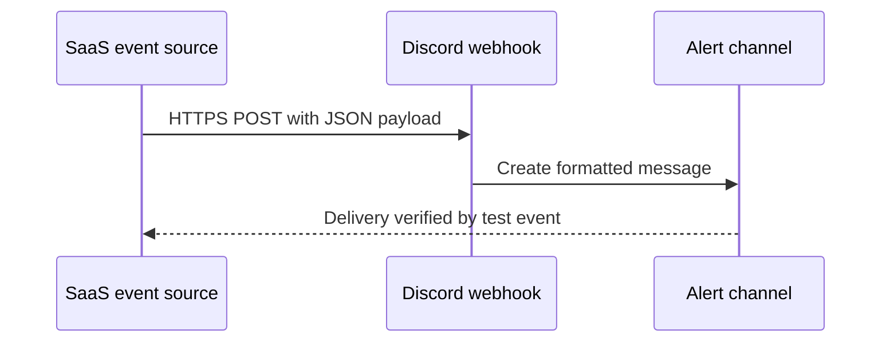

# Case Study: SaaS Webhook Alerting

A sanitized case study showing how an event from one SaaS platform was delivered to Discord through an incoming webhook. The original implementation used TradingView as the event source, but the same pattern applies to monitoring, ticketing, and status tools.

No live webhook URL, account identifier, server name, channel name, or alert history is stored in this repository.

## Objective

Deliver time-sensitive events automatically, preserve a searchable notification history, and avoid maintaining a custom relay server.

## Architecture

## Implementation

1. Created a dedicated incoming webhook for a test channel.
2. Stored the endpoint only in the source platform's secret configuration.
3. Built a minimal JSON payload using source-platform placeholders.
4. Triggered a controlled test event and verified destination, formatting, and variable substitution.
5. Repeated the test after a new session to confirm the configuration persisted.
6. Documented failure symptoms and recovery actions.

The repository includes a [sanitized sample payload](examples/discord-payload.json). Placeholder values are deliberately used instead of a functional webhook endpoint.

## Validation

- The test event arrived in the intended channel.
- Dynamic fields were rendered instead of appearing as raw placeholders.
- The payload remained valid JSON.
- Repeated events produced a persistent channel history.
- The webhook secret was absent from source files and Git history.

## Security Controls

- Treat the full webhook URL as a secret because it can authorize message delivery.
- Use a dedicated webhook with the minimum required destination scope.
- Revoke and recreate the webhook if it is exposed.
- Keep production endpoints out of screenshots, tickets, logs, and repositories.
- Validate untrusted event content before forwarding it to additional systems.

See [SECURITY.md](SECURITY.md) for the disclosure and rotation procedure.

## Troubleshooting

The [troubleshooting matrix](docs/troubleshooting-matrix.md) covers invalid JSON, authentication failures, rate limiting, placeholder problems, and wrong-channel delivery.

## Evidence Limitations

This repository is a documentation-only reconstruction. Production event logs and the live webhook endpoint were intentionally excluded, so the included sample demonstrates payload structure rather than proving access to either SaaS account.

## Skills Demonstrated

Webhook configuration, JSON validation, secret handling, cross-platform troubleshooting, event-driven alerting, and operational documentation.

